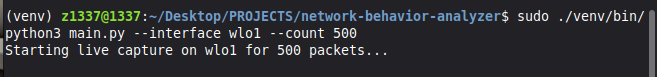
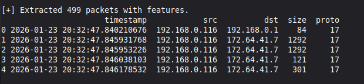
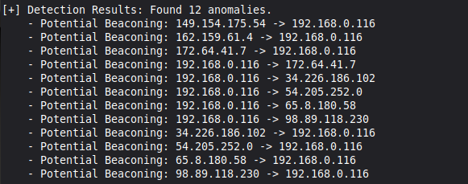
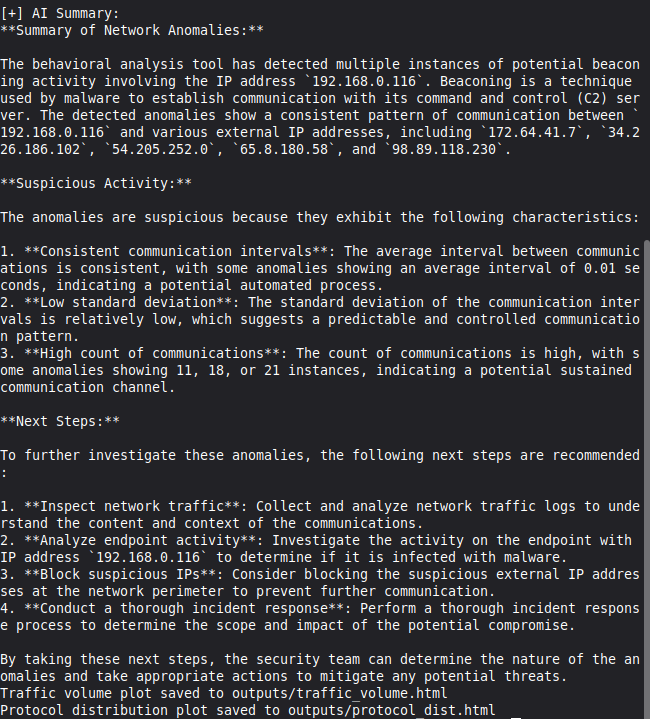
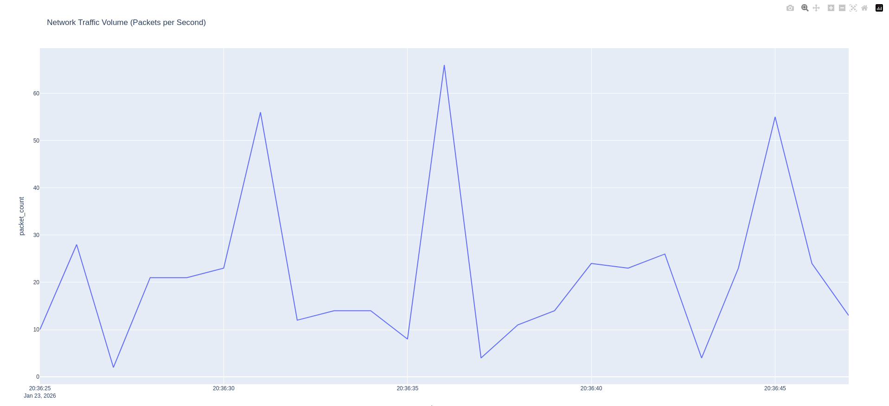
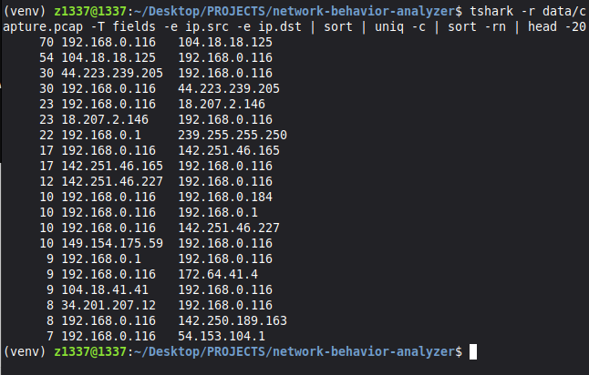

# Network Traffic Behavioral Analyzer

## Project Overview
The Network Traffic Behavioral Analyzer is a cybersecurity tool designed to identify network anomalies through behavioral analysis rather than simple signatures. By analyzing traffic flows, it detects potential Command & Control (C2) beaconing and data exfiltration attempts.

## Key Objectives
- **Traffic Capture**: Analyze live network traffic or process existing PCAP files using Scapy.
- **Behavioral Detection**: 
    - **C2 Beaconing**: Identifies rhythmic traffic patterns common in malware communications.
    - **Data Exfiltration**: Detects unusual outbound data volumes to external IPs.
- **AI-Powered Insights**: Integrates with LLMs (Groq - Llama 3) to provide human-readable summaries of suspicious traffic flows.
- **Visual Analytics**: Generates interactive visualizations of traffic volume and protocol distribution using Plotly.

## Lab Execution & Evidence

### 1. Project Initialization & Live Capture
Starting the behavioral analyzer on the active network interface to capture live traffic for analysis.

*Terminal showing the start of live packet capture on the wireless interface.*

### 2. Feature Extraction
The tool processes raw packets and extracts key flow metrics including timestamps, source/destination IPs, sizes, and protocols.

*Extracted packet features table showing processed network traffic.*

### 3. Anomaly Detection Results
The detection engine identifies potential C2 beaconing patterns based on traffic rhythm and volume anomalies.

*Detection results flagging multiple instances of potential C2 beaconing.*

### 4. AI-Powered Threat Summarization
Integrating Groq (Llama 3) to provide a natural language summary of the detected anomalies for a SOC analyst.

*AI-generated summary explaining the risks and recommended next steps.*

### 5. Traffic Volume Visualization
Visualizing traffic spikes and volume over time to identify unusual bursts of activity.

*Interactive Plotly dashboard showing network traffic volume per second.*

### 6. Manual Verification (Wireshark/Tshark)
Verifying automated findings using industry-standard tools like Tshark to validate the rhythmic nature of the flagged traffic.

*Manual verification of suspicious traffic flows using Tshark.*

## How to Use
1. Clone the repo: `git clone https://github.com/jacobdcook/network-behavior-analyzer`
2. Create virtual environment: `python3 -m venv venv`
3. Activate virtual environment: `source venv/bin/activate`
4. Install dependencies: `pip install -r requirements.txt`
5. Set Environment Variables: Create a `.env` file with your `GROQ_API_KEY`.
6. Run the Analyzer: `sudo ./venv/bin/python3 main.py --interface wlo1 --count 500 --save-pcap data/capture.pcap`

## Learning Outcomes
- Advanced understanding of network protocols and behavioral threat detection.
- Proficiency in using Scapy for custom packet manipulation and analysis.
- Integration of AI/LLMs into security monitoring workflows.
- Experience with industry-standard tools like Wireshark/Tshark for incident validation.
